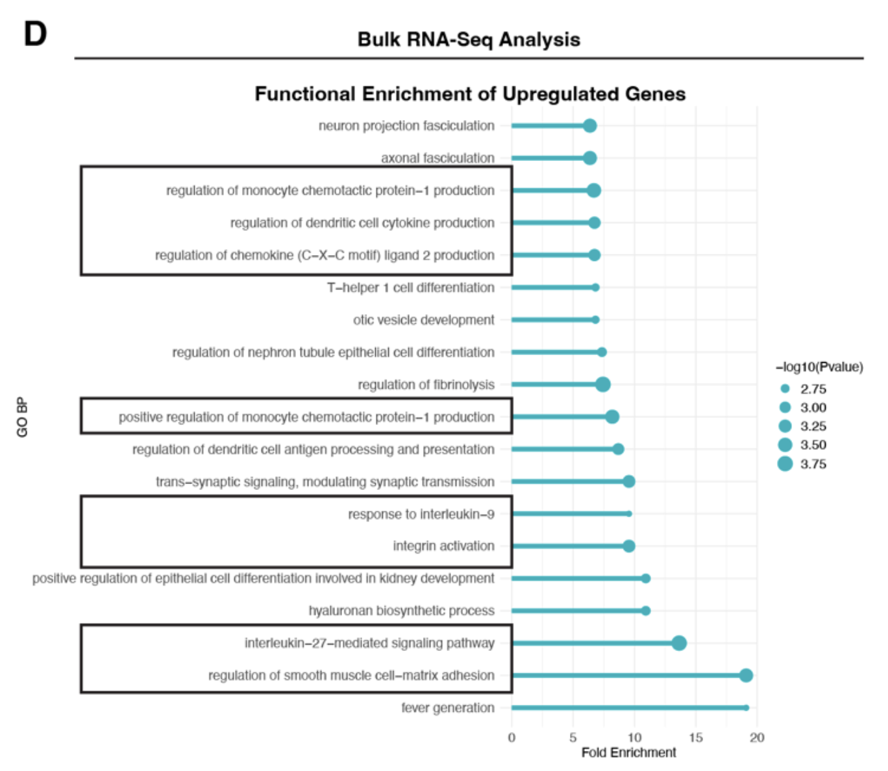
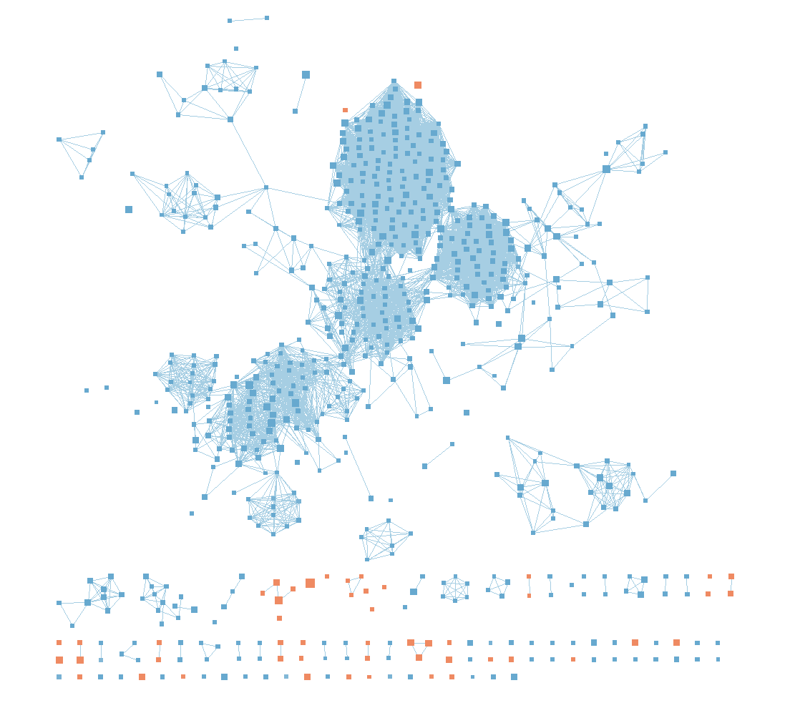
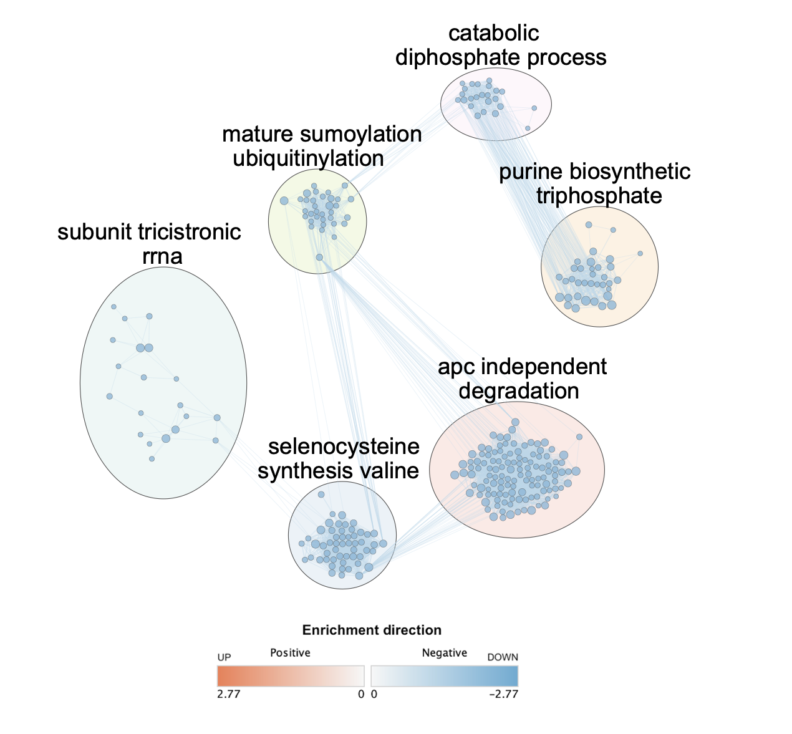

## Introduction
In Assignment 1, we analysed a bulk RNA-seq dataset from GEO accession [`GSE253464`](https://www.ncbi.nlm.nih.gov/geo/query/acc.cgi), which was published as part of a study by Martell et al. (2025). One of the focuses of the study was the role of adding the metabolic inhibitor UK-5099 to conventional treatment regimen of temozolomide plus radiation (TMZ‑RT) for glioblastoma (GBM). The authors reported that metabolic intervention restored expression of neuronal differentiation genes, suggesting that targeting tumour metabolism may promote differentiation and potentially reduce the stem-like properties associated with glioblastoma aggressiveness and recurrence.

In our previous analysis, we first obtained the raw count data from the GSE database. We handled replicate genes by summing their read counts and treated each sample as separate observations rather than averaging counts across treatment conditions. We also removed data that was incorrectly formatted. Then, we normalised the data by applying trimmed mean of M-values (TMM) and filtered out lowly expressed genes, ensuring that the data is corrected for any sequencing depth and composition bias. These steps resulted in us filtering out nearly 30,000 genes, with our final dataset consisting of 15,630 genes across 12 different samples. Each of these 12 samples were part of one of four treatment conditions (naive, TMZ-RT, UK-5099, TMZ-RT + UK-5099). We then conducted a differential expression analysis for three contrasts (naive vs. TMZ-RT, naive vs. UK-5099, naive vs. TMZ-RT + UK-5099) and found significantly up- and down-regulated genes for each analysis.

Our downstream analyses will focus on using the output from Assignment 1 to conduct both thresholded and non-thresholded over-representation analyses (ORA), and interpret their results using enrichment maps to connect it back to the focus of the original paper. I will focus the downstream enrichment analyses on the TMZ-RT + UK-5099 versus naive comparison because it is the most directly relevant to the study’s main question, which is whether metabolic inhibition after TMZRT changes the GBM transcriptional program. By narrowing to this contrast, it will allow me to analyse the biologically central comparison in more depth rather than covering all the contrasts.

## Installing relevant packages

```{r, message = FALSE, warning = FALSE}
# Install packages
if(!requireNamespace("knitr", quietly = TRUE)) {
  install.packages("knitr")
}

if(!requireNamespace("rmarkdown", quietly = TRUE)) {
  install.packages("rmarkdown")
}

if(!requireNamespace("readr", quietly = TRUE)) {
  install.packages("readr")
}

if(!requireNamespace("dplyr", quietly = TRUE)) {
  install.packages("dplyr")
}

if(!requireNamespace("gprofiler2", quietly = TRUE)) {
  install.packages("gprofiler2")
}

# Set working directory - ensure data and figures are loaded in properly
library("knitr")
opts_knit$set(root.dir = "~/projects/Jeremy_Chan/A2")
```

## Thresholded over-representation analysis

We will run a thresholded over-representation analysis (ORA) using the g:Profiler R package. I picked this method mainly because I am familiar with it, as we demonstrated use of it during the in-class exercises. It is also the only method introduced in the lectures (DAVID, ErichR, GREAT) that has an official R package.

To do this, we will first process the data that we obtained from Assignment 1, separating up- and down-regulated genes in the data. Then, we will run a query on g:Profiler to see if any gene sets are enriched or under-represented. Finally, we will interpret these lists and connect them to findings in other papers.

### Data processing

First, we will read in the significant genes (FDR \< 0.05) that was found in Assignment 1. Then, we will create separate lists for strongly up- (logFC \> 1) and down-regulated genes (logFC \< -1) for downstream analysis.

```{r, message = FALSE, warning = FALSE}
# Load in relevant libraries
library("readr")
library("dplyr")

# Load in the list of significant genes (FDR < 0.05), then remove genes that are not significantly up- or down-regulated (-1 < logFC < 1)

# Combo vs. Naive comparison
combo_naive_sig_genes <- read_csv("Combo_vs_Naive_Significant_Genes.csv", show_col_types = FALSE)

# Get significantly up-regulated genes
combo_naive_up <- combo_naive_sig_genes %>%
  filter(direction == "Up-regulated")

# Get significantly down-regulated genes
combo_naive_down <- combo_naive_sig_genes %>%
  filter(direction == "Down-regulated")
```

Now, we have lists for significantly up- and down-regulated genes, as well as the combined list for this contrast.

### g:Profiler querying

Prior to conducting the ORA, we will first query the gene sets from g:Profiler and subset the gene sets by setting a threshold on their size (5 \<= gene set size \<= 200). This will ensure that we are not capturing gene sets that may be over-generalised, or too small in size, which can skew their significance level.

I will be using the annotation data sources GO biological process (<GO:BP>), Reactome, and WikiPathways in the query. <GO:BP> (version 2025-03-16) was included because it provides broad coverage of biological processes and is widely used for functional interpretation of differential gene expression results. Reactome (version 2025-5-23) was included because it contains expert curated signaling and metabolic pathways, allowing more precise interpretation of molecular mechanisms affected by treatment. WikiPathways (version 20250510) was included because it provides community-curated pathway annotations that can capture emerging or specialized biological pathways not always present in other databases. Annotation versions were obtained by running `gprofiler2::get_version_info()`.

```{r, message = FALSE, warning = FALSE}
# Load in relevant libraries
library(gprofiler2)

# Run g:Profiler query for the up-regulated list
combo_naive_up_gprof <- gost(query = combo_naive_up$gene,
                             organism = "hsapiens",
                             significant = FALSE,
                             exclude_iea = TRUE,
                             correction_method = "fdr",
                             domain_scope = "annotated",
                             sources = c("GO:BP", "REAC", "WP"))

# Run g:Profiler query for the down-regulated list
combo_naive_down_gprof <- gost(query = combo_naive_down$gene,
                             organism = "hsapiens",
                             significant = FALSE,
                             exclude_iea = TRUE,
                             correction_method = "fdr",
                             domain_scope = "annotated",
                             sources = c("GO:BP", "REAC", "WP"))

# Run g:Profiler query for the full list
combo_naive_gprof <- gost(query = combo_naive_sig_genes$gene,
                             organism = "hsapiens",
                             significant = FALSE,
                             exclude_iea = TRUE,
                             correction_method = "fdr",
                             domain_scope = "annotated",
                             sources = c("GO:BP", "REAC", "WP"))

# Subset g:Profiler results in up-regulated genes
filtered_combo_naive_up <- combo_naive_up_gprof$result %>%
  filter(term_size >= 5, term_size <= 200) %>%
  arrange(p_value) %>%
  dplyr::select(p_value, term_size, term_name, source)

# Subset g:Profiler results in down-regulated genes
filtered_combo_naive_down <- combo_naive_down_gprof$result %>%
  filter(term_size >= 5, term_size <= 200) %>%
  arrange(p_value) %>%
  dplyr::select(p_value, term_size, term_name, source)

# Subset g:Profiler results in full list of genes
filtered_combo_naive <- combo_naive_gprof$result %>%
  filter(term_size >= 5, term_size <= 200) %>%
  arrange(p_value) %>%
  dplyr::select(p_value, term_size, term_name, source)
```

After thresholding for term size, the query for the full list, up-regulated genes, and down-regulated genes returned 7470, 6720, and 3864 gene sets respectively.

Now, we can compare the top ten entries by p-value in each list to one another.

```{r, message = FALSE, warning = FALSE}
library("knitr")

kable(
  filtered_combo_naive[1:10, ],
  caption = "Table 1. Top 10 enriched pathways from g:Profiler thresholded over-representation analysis using all significantly differentially expressed genes for the TMZRT + UK5099 vs Naive comparison sorted by descending p-value. p_value indicates the statistical significance of pathway enrichment. term_size is the number of genes associated with the pathway in the annotation database. term_name describes the biological process represented by the gene set. source indicates the annotation database from which the term originates (GO:BP = Gene Ontology Biological Process, REAC = REACTOME).")

kable(
  filtered_combo_naive_up[1:10, ],
  caption = "Table 2. Top 10 enriched pathways from g:Profiler thresholded over-representation analysis using significantly up-regulated genes for the TMZRT + UK5099 vs Naive comparison sorted by descending p-value. p_value indicates the statistical significance of pathway enrichment. term_size is the number of genes associated with the pathway in the annotation database. term_name describes the biological process represented by the gene set. source indicates the annotation database from which the term originates (GO:BP = Gene Ontology Biological Process, REAC = REACTOME).")

kable(
  filtered_combo_naive_down[1:10, ],
  caption = "Table 3. Top 10 enriched pathways from g:Profiler thresholded over-representation analysis using significantly down-regulated genes for the TMZRT + UK5099 vs Naive comparison sorted by descending p-value. p_value indicates the statistical significance of pathway enrichment. term_size is the number of genes associated with the pathway in the annotation database. term_name describes the biological process represented by the gene set. source indicates the annotation database from which the term originates (GO:BP = Gene Ontology Biological Process, REAC = REACTOME).")
```

Comparing the tables, we see that most of the enriched pathways identified from the full list of differentially expressed genes appear to be driven primarily by the up-regulated genes. Many of the top pathways in the full list, such as collagen formation, cell adhesion mediated by integrin, and interferon alpha/beta signaling, are also present in the up-regulated gene enrichment results. However, the ranking of these pathways differs slightly between the two analyses. For example, collagen formation appears as the most significant pathway in the full list but ranks fifth when only the up-regulated genes are analysed. In contrast, the down-regulated gene set shows a different set of enriched pathways, with no overlap with the top pathways identified in the full or up-regulated gene lists. This suggests that the strongest enrichment signals in this comparison are largely driven by genes that are up-regulated in the TMZ-RT + UK-5099 (combination) condition.

### Interpretation

Comparing the top enriched pathways from the up-regulated gene list in the original paper in Figure 1, we see that many of the same pathways are present in our full and up-regulated lists, such as integrin and interferon-mediated signaling. This suggests that our results are consistent with the original paper. However, there are clear differences in the ranking as well as the naming of the pathways, which in part are due to the annotation sources being used; the original paper only uses <GO:BP>, while we have utilised a more diverse set of sources. The other main pathways concerning collagen and extracellular matrix (ECM) organisation are not present in the original paper, which may be due to differences in the thresholding of the gene lists, or differences in the annotation sources used. Overall, our results are broadly consistent with the original paper, but may be providing additional insights into other pathways that are also affected by treatment.


**Figure 1. Supplementary Figure S4D from the paper "Disease stage-specific role of the mitochondrial pyruvate carrier suppresses differentiation in temozolomide and radiation-treated glioblastoma" (Martell et al., 2025): Functional enrichment of upregulated genes from bulk RNA-seq analysis.** GO:BP (Gene Ontology Biological Processes) pathways enriched among up-regulated genes are shown. Fold enrichment is plotted on the x-axis, and point size represents enrichment significance (−log10(p-value)).

A paper by Wang et al. (2022) found that integrin-mediated mechanisms, such as cell adhesion and signalling, play a crucial role in GBM progression and resistance to therapy. In addition to the original study, this further supports our finding of integrin-related pathways being enriched in the up-regulated gene list, suggesting that these mechanisms may be upregulated in response to TMZ-RT + UK-5099 treatment. Furthermore, I wanted to find out if the pathways that did not match the original study were previously investigated. I found that a study by Mohiuddin & Wakimoto (2021) showed that ECM organisation, particularly its contributions to cell invasion, is a key factor in therapeutic resistance in GBM. This supports our finding of collagen and ECM-related pathways being enriched, suggesting that these processes may also be up-regulated in response to treatment and contribute to mechanisms concerning recurrence.

## Non-thresholded Gene set Enrichment Analysis

We will now run a non-thresholded gene set enrichment analysis (GSEA - pre-ranked) using their command-line software. I chose this method because it is a widely used and well-established method for gene set enrichment analysis that does not require an arbitrary threshold for significance. Additionally, I have some familiarity with the GSEA software from the in-class exercises, which will allow me to run the analysis more efficiently.

### Analysis setup

First, we will prepare the variables that GSEA requires, such as paths to the input files and the .gmt file, as well as parameters for the analysis such as the minimum and maximum gene set size. Then, we will run the GSEA software using these parameters. For this analysis, I will be using the second most recent release of the enrichment map gene sets from the Bader lab, which is the September 1, 2025 release (as of March 8th, 2026).

```{r, message = FALSE, warning = FALSE}
# Prepare rank file
if (!file.exists("Combo_vs_Naive_Ranked_Genes.rnk")) {
  combo_naive_all_genes <- read_csv("Combo_vs_Naive_All_Genes.csv", show_col_types = FALSE)
  
  combo_naive_rnk <- combo_naive_all_genes %>%
  mutate(rank = -log10(PValue) * sign(logFC)) %>%
  arrange(desc(rank)) %>% # By arranging it in descending order: negative = upregulated in naive, positive = upregulated in combo treatment
  dplyr::select(gene, rank)

  write.table(combo_naive_rnk, "Combo_vs_Naive_Ranked_Genes.rnk", 
            sep = "\t", quote = FALSE, row.names = FALSE, col.names = FALSE)
}

# Set parameters for GSEA analysis
analysis_name <- "GSEA_Combo_vs_Naive"
rnk_file <- "Combo_vs_Naive_Ranked_Genes.rnk"
run_gsea <- FALSE # For efficient compilation of the notebook
gsea_jar <- "~/projects/Jeremy_Chan/GSEA_4.4.0/gsea-cli.sh"
gsea_directory <- ""
fdr_thresh <- 0.01
pval_thresh <- 1
java_version <- 11
output_dir <- "~/projects/Jeremy_Chan/A2"
working_dir <- "~/projects/Jeremy_Chan/A2"
dest_gmt_file <- "Human_GOBP_AllPathways_noPFOCR_no_GO_iea_September_01_2025_symbol.gmt" # Non-empty for efficient compilation of the notebook

# Get GMT file
if (dest_gmt_file == "") {
  gmt_url <- "https://download.baderlab.org/EM_Genesets/September_01_2025/Human/symbol/"

  # Read directory listing
  page_lines <- readLines(gmt_url)

  # Extract GMT filename
  rx <- gregexpr(
    "(?<=<a href=\")(.*GOBP_AllPathways_noPFOCR_no_GO_iea.*\\.gmt)(?=\">)", 
    page_lines,
    perl = TRUE
  )
  
  gmt_file <- unlist(regmatches(page_lines, rx))
  dest_gmt_file <- file.path(output_dir, gmt_file)

  # Download if file does not exist
  if (!file.exists(dest_gmt_file)) {
    download.file(
      url = paste0(gmt_url, gmt_file),
      destfile = dest_gmt_file
    )
  }
}
```

### GSEA analysis

Now that we have the parameters set up, we can run the GSEA analysis using the command line software. We will specify the input files, output directory, and parameters such as the minimum (5) and maximum (200) gene set size matching the non-thresholded ORA in the previous section, as well as the number of permutations to run.

```{r, message = FALSE, warning = FALSE}
# Run GSEA
if(run_gsea) {
  command <- paste("", gsea_jar,
                   "GSEAPreRanked -gmx", dest_gmt_file,
                   "-rnk", file.path(working_dir, rnk_file),
                   "-collapse false -nperm 1000 -scoring_scheme weighted", # ranked
                   "-rpt_label ", analysis_name,
                   "-plot_top_x 20 -rnd_seed 99 -set_max 200",
                   "-set_min 5 -zip_report false",
                   "-out ", output_dir,
                   " > gsea_output.txt", sep = " ")
  system(command)
}
```

We can now display the top ten entries by normalised enrichment score (NES), and compare them to the previous thresholded ORA.

```{r, message = FALSE, warning = FALSE}
# Read in the GSEA for gene sets that are enriched in combo treatment samples
combo_up <- read_tsv("results/gsea_report_for_na_pos_1772951764529.tsv") %>%
  dplyr::select(NAME, SIZE, NES, `NOM p-val`, `FDR q-val`) %>%
  mutate(NAME = sub("%.*", "", NAME)) %>%  # Clean NAME column for easier viewing
  as.data.frame()

# Read in the GSEA for gene sets that are enriched in naive samples
naive_up <- read_tsv("results/gsea_report_for_na_neg_1772951764529.tsv") %>%
  dplyr::select(NAME, SIZE, NES, `NOM p-val`, `FDR q-val`) %>%
  mutate(NAME = sub("%.*", "", NAME)) %>%  # Clean NAME column for easier viewing
  as.data.frame()

kable(combo_up[1:10, ], caption = "Table 4. Top 10 enriched pathways sorted by descending NES in treated samples from GSEA non-thresholded over-representation analysis using all genes for the TMZRT + UK5099 vs Naive comparison. NAME indicates the pathway or gene set. SIZE is the number of genes from the pathway present in the dataset. NES (Normalized Enrichment Score) reflects the strength of pathway enrichment after adjusting for gene set size. NOM p-val is the nominal permutation p-value for the enrichment score. FDR q-val is the multiple testing corrected false discovery rate.")

kable(naive_up[1:10, ], caption = "Table 5. Top 10 enriched pathways sorted by descending NES in naive samples from GSEA non-thresholded over-representation analysis using all genes for the TMZRT + UK5099 vs Naive comparison. NAME indicates the pathway or gene set. SIZE is the number of genes from the pathway present in the dataset. NES (Normalized Enrichment Score) reflects the strength of pathway enrichment after adjusting for gene set size. NOM p-val is the nominal permutation p-value for the enrichment score. FDR q-val is the multiple testing corrected false discovery rate.")
```

The GSEA results show that several immune and inflammatory signaling pathways are enriched in the combination treatment samples. The top pathways include interferon alpha response, interferon gamma response, and inflammatory response pathways. This suggests that the treated samples exhibit increased immune and inflammatory signaling activity. In contrast, the pathways enriched in naive samples are mainly related to translation and ribosome function, including MYC targets, ribosomal proteins, translation initiation, nonsense-mediated decay, and rRNA processing. These pathways are associated with protein synthesis and cellular growth processes. Overall, the results suggest a shift from translation and ribosome-related pathways in naive cells toward immune and inflammatory signaling pathways in the treated condition.

Qualitatively, these results are somewhat consistent with the thresholded ORA, where immune and cytokine-related pathways were also enriched in the treated samples (up-regulated), but enriched pathways did not match in the naive samples (down-regulated). However, this comparison is not completely straightforward. The thresholded analysis only includes genes that pass a significance cutoff (e.g., FDR \< 0.05), whereas GSEA uses a ranked list of all genes without applying a threshold. Because of this, GSEA can detect pathways where many genes change modestly but consistently, even if they are not individually significant. As a result, while the overall biological themes are similar, the exact pathways and their ranking may differ between the two approaches.

### Enrichment map visualisation

We can now put this data into Cytoscape to generate an enrichment map. After entering all the data in, an initial enrichment map was outputted.


**Figure 2. Initial enrichment map of GSEA results for the TMZRT + UK5099 vs Naive comparison.** Nodes represent enriched gene sets and edges represent gene overlap between pathways. Node color indicates enrichment direction and significance (−log10(p-value) × sign(NES)), with red indicating enrichment in treated samples and blue indicating enrichment in naive samples. This network shows the full set of enriched pathways prior to manual layout and cluster annotation.


I used the thresholds of FDR \< 0.01 (for nodes) and cut-off \< 0.5 (for edges). In this initial enrichment map, there are 659 nodes and 7314 edges.

Now, we can cluster the nodes and annotate them to refine the enrichment map and create a "theme-based" network. To annotate the enrichment map, I used all default settings on the AutoAnnotate application on Cytoscape, but ensuring to check the box for minimising cluster overlap. I then filtered out nodes that had a degree of 0, becasue they were not part of any minor or major network in the enrichment map. Finally, I examined the clusters that AutoAnnotate outputted and decided to only include clusters that had more than 20 nodes, resulting in six different clusters.


**Figure 3. Annotated enrichment map summarizing major pathway themes identified from the GSEA analysis of the TMZRT + UK5099 vs Naive comparison.** Each node represents an enriched gene set and edges represent gene overlap between pathways. Clusters of related pathways are highlighted and labeled to summarize the dominant functional themes. Node color reflects enrichment direction and significance (−log10(p-value) × sign(NES)), where blue indicates pathways enriched in naive samples and red indicates pathways enriched in treated samples. Only clusters containing at least 20 pathways were retained for visualization to improve interpretability.

After clustering and annotating the enrichment map using AutoAnnotate, the network was collapsed into several major biological themes. The main clusters include pathways related to APC-independent proteasomal degradation, post-translational protein modification (sumoylation and ubiquitinylation), purine and nucleotide metabolism, RNA and rRNA processing, and amino acid metabolism (selenocysteine and valine synthesis). Many of the clusters identified in the theme network correspond to processes involved in protein turnover, RNA processing, and nucleotide metabolism. These pathways are commonly associated with actively proliferating cells because they support protein synthesis, transcriptional activity, and metabolic regulation. In the context of the model proposed in the original study, these pathways are consistent with the idea that untreated or naive cells maintain a transcriptionally active and proliferative state. In contrast, treatment with TMZRT and metabolic inhibition is proposed to alter cellular metabolism and epigenetic regulation through reduced acetyl-CoA and histone acetylation, which can shift gene expression programs and cellular state.

### Interpretation

The GSEA and enrichment map results differ from the thresholded ORA because GSEA uses a ranked list of all genes rather than only those passing an FDR threshold. As a result, GSEA can detect pathways where many genes change modestly but consistently across the ranked list. In contrast, the thresholded analysis focuses only on strongly differentially expressed genes. Consequently, the pathways identified in the GSEA analysis differ from those detected in the thresholded analysis. While the thresholded analysis highlighted pathways related to developmental and signaling processes, the GSEA analysis identified broader functional themes such as RNA processing, nucleotide metabolism, and proteasomal degradation.

The enrichment map results are also supported by findings from other studies. For example, the largest cluster identified in the network, APC-independent degradation, corresponds to ubiquitin-independent proteasomal degradation pathways. According to Erales & Coffino (2014), this form of proteasomal degradation can be regulated by cellular polyamine levels, which are small organic molecules important for cell growth and viability. Polyamines have also been linked to chromatin regulation, as Hobbs & Gilmour (2000) showed that elevated polyamine levels can stimulate histone acetyltransferase activity, increasing histone acetylation and promoting gene expression. In the context of glioblastoma, the original study reported that increased histone acetylation is associated with activation of neuronal differentiation genes such as NEUROD1 and DCX. Therefore, the enrichment of this theme in therapy-naive cells in Figure 3 is consistent with these previous findings.

## Conclusion

In this assignment, we applied both thresholded ORA and non-thresholded GSEA to interpret differential expression results from the TMZ-RT + UK5099 versus naive comparison in GBM. The thresholded ORA identified enrichment of immune and signaling pathways among genes up-regulated in treated samples, including interferon and integrin-related pathways. These results were broadly consistent with findings reported in the original study. The non-thresholded GSEA analysis provided a complementary perspective by considering the ranked list of all genes rather than only those passing a significance cutoff. This analysis, accompanied by visualisation using an enrichment map, revealed broader functional themes, including translation, RNA processing, nucleotide metabolism, and proteasomal degradation, which were enriched primarily in naive samples. Together, these results suggest that therapy-naive GBM cells exhibit transcriptional programs associated with active protein synthesis, metabolism, and cellular proliferation, while the combination treatment shifts gene expression toward immune and inflammatory signaling pathways, highlighting new pathways that are of potential study which were not mentioned in the initial study.

## References

---
nocite: '@*'
---
